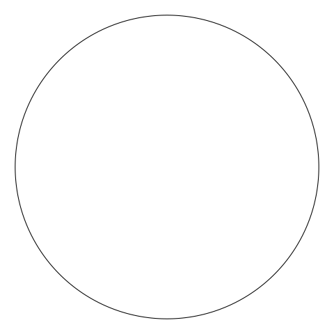
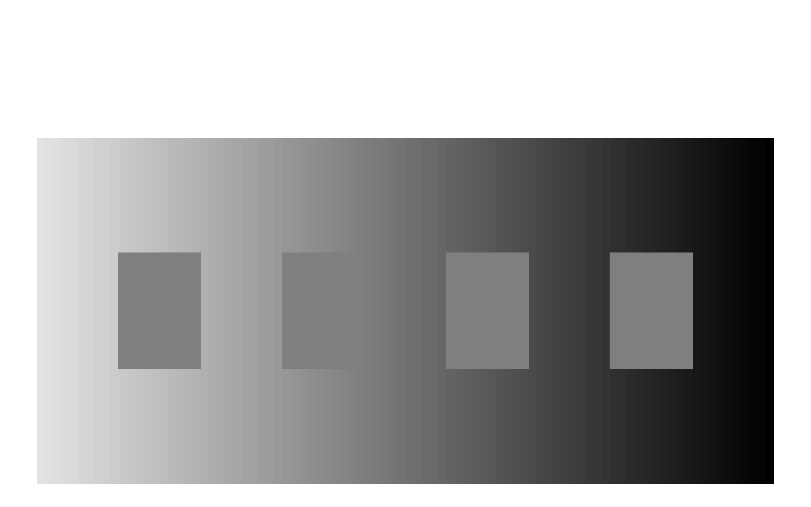

# shapes-and-tricks

Not sure exactly what the purpose of this repo is, but mainly to challenge myself making shapes and color tricks.

### 01-01-2021 Animated circle

Playing around with fading in-and-out circles.

[Link to code]()

circle_anim
### 20-12-2020 Same color squares

Squares below are the same color ('gray50')while only the background changes.

[Link to code]()

